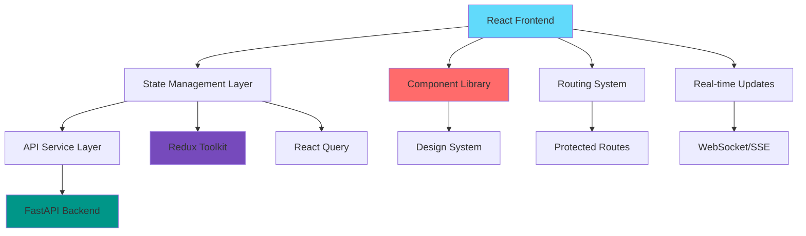

# Design Document

## Overview

The enhanced LinkedIn Sourcing Agent frontend will be built as a modern, production-ready React application using contemporary web technologies and design patterns. The application will feature a component-based architecture with TypeScript for type safety, a comprehensive design system, real-time data synchronization, and enterprise-grade performance optimizations.

The design emphasizes modularity, scalability, and maintainability while providing an intuitive user experience for recruiters and hiring managers. The application will integrate seamlessly with the existing FastAPI backend and support future extensibility.

## Architecture

### High-Level Architecture



### Technology Stack

| Category | Technology | Version | Purpose |
|----------|------------|---------|---------|
| **Core** | React | 18+ | UI Framework |
| **Language** | TypeScript | 5+ | Type Safety |
| **Build Tool** | Vite | 5+ | Development & Build |
| **State Management** | Redux Toolkit | 2+ | Global State |
| **Data Fetching** | TanStack Query | 5+ | Server State |
| **Styling** | Tailwind CSS | 3+ | Utility-first CSS |
| **UI Components** | Headless UI | 2+ | Accessible Components |
| **Icons** | Lucide React | Latest | Icon Library |
| **Charts** | Recharts | 2+ | Data Visualization |
| **Forms** | React Hook Form | 7+ | Form Management |
| **Validation** | Zod | 3+ | Schema Validation |
| **Routing** | React Router | 6+ | Client-side Routing |
| **Real-time** | Socket.IO Client | 4+ | WebSocket Communication |
| **Testing** | Vitest + RTL | Latest | Unit & Integration Tests |

### Project Structure

```
frontend/
├── src/
│   ├── components/           # Reusable UI components
│   │   ├── ui/              # Base design system components
│   │   ├── forms/           # Form-specific components
│   │   ├── charts/          # Data visualization components
│   │   └── layout/          # Layout components
│   ├── pages/               # Route-level page components
│   │   ├── Dashboard/       # Dashboard and analytics
│   │   ├── Jobs/           # Job management
│   │   ├── Candidates/     # Candidate management
│   │   ├── Pipeline/       # Pipeline monitoring
│   │   └── Settings/       # Configuration
│   ├── hooks/              # Custom React hooks
│   ├── services/           # API service layer
│   ├── store/              # Redux store configuration
│   ├── types/              # TypeScript type definitions
│   ├── utils/              # Utility functions
│   ├── constants/          # Application constants
│   └── styles/             # Global styles and themes
├── public/                 # Static assets
├── tests/                  # Test files
└── docs/                   # Component documentation
```

## Components and Interfaces

### Core Component Architecture

#### 1. Design System Components (`src/components/ui/`)

**Button Component**
```typescript
interface ButtonProps {
  variant: 'primary' | 'secondary' | 'outline' | 'ghost' | 'danger'
  size: 'sm' | 'md' | 'lg'
  loading?: boolean
  disabled?: boolean
  icon?: React.ReactNode
  children: React.ReactNode
  onClick?: () => void
}
```

**Card Component**
```typescript
interface CardProps {
  title?: string
  subtitle?: string
  actions?: React.ReactNode
  loading?: boolean
  className?: string
  children: React.ReactNode
}
```

**DataTable Component**
```typescript
interface DataTableProps<T> {
  data: T[]
  columns: ColumnDef<T>[]
  loading?: boolean
  pagination?: PaginationConfig
  sorting?: SortingConfig
  filtering?: FilteringConfig
  selection?: SelectionConfig
  onRowClick?: (row: T) => void
}
```

#### 2. Feature Components

**CandidateCard Component**
```typescript
interface CandidateCardProps {
  candidate: Candidate
  onSelect?: (candidate: Candidate) => void
  onViewProfile?: (candidate: Candidate) => void
  onGenerateMessage?: (candidate: Candidate) => void
  showActions?: boolean
  compact?: boolean
}
```

**PipelineMonitor Component**
```typescript
interface PipelineMonitorProps {
  jobId: string
  onStageComplete?: (stage: PipelineStage) => void
  onError?: (error: PipelineError) => void
  realTime?: boolean
}
```

**JobForm Component**
```typescript
interface JobFormProps {
  initialData?: Partial<JobDescription>
  onSubmit: (data: JobDescription) => void
  onCancel?: () => void
  templates?: JobTemplate[]
  mode: 'create' | 'edit' | 'template'
}
```

### Page-Level Components

#### 1. Dashboard Page
- **Overview Cards**: Key metrics and KPIs
- **Analytics Charts**: Interactive data visualizations
- **Recent Activity**: Latest pipeline runs and candidates
- **Quick Actions**: Shortcuts to common tasks

#### 2. Jobs Management Page
- **Job List**: Searchable and filterable job listings
- **Job Creation**: Comprehensive job form with templates
- **Job Templates**: Reusable job description templates
- **Bulk Operations**: Multi-job management actions

#### 3. Candidates Page
- **Candidate Grid**: Advanced filtering and sorting
- **Candidate Profiles**: Detailed candidate information
- **Bulk Actions**: Multi-candidate operations
- **Export Tools**: Data export functionality

#### 4. Pipeline Monitoring Page
- **Active Pipelines**: Real-time pipeline status
- **Pipeline History**: Historical pipeline data
- **Performance Metrics**: Pipeline efficiency analytics
- **Error Logs**: Detailed error tracking and resolution

## Data Models

### Core Data Types

```typescript
// Job-related types
interface JobDescription {
  id: string
  title: string
  company: string
  description: string
  requirements: string[]
  location: string
  skills: string[]
  remote: boolean
  salaryRange: string
  createdAt: Date
  updatedAt: Date
  status: 'draft' | 'active' | 'paused' | 'completed'
}

interface JobTemplate {
  id: string
  name: string
  description: string
  template: Partial<JobDescription>
  tags: string[]
  createdAt: Date
}

// Candidate-related types
interface Candidate {
  id: string
  name: string
  email?: string
  linkedinUrl: string
  profilePicture?: string
  title: string
  company: string
  location: string
  skills: string[]
  experience: number
  score: number
  scoreBreakdown: ScoreBreakdown
  summary: string
  education: Education[]
  workHistory: WorkExperience[]
  createdAt: Date
  updatedAt: Date
  status: 'new' | 'contacted' | 'responded' | 'interested' | 'not_interested'
  tags: string[]
}

interface ScoreBreakdown {
  skillsMatch: number
  experienceMatch: number
  locationMatch: number
  overallFit: number
  details: string
}

// Pipeline-related types
interface PipelineRun {
  id: string
  jobId: string
  status: 'running' | 'completed' | 'failed' | 'cancelled'
  currentStage: PipelineStage
  stages: PipelineStageResult[]
  candidatesFound: number
  startTime: Date
  endTime?: Date
  duration?: number
  errors: PipelineError[]
}

interface PipelineStage {
  name: 'discovery' | 'enrichment' | 'scoring' | 'messaging'
  status: 'pending' | 'running' | 'completed' | 'failed'
  progress: number
  message: string
  startTime?: Date
  endTime?: Date
}

// UI State types
interface UIState {
  theme: 'light' | 'dark'
  sidebarCollapsed: boolean
  notifications: Notification[]
  loading: Record<string, boolean>
  errors: Record<string, string>
}

interface FilterState {
  candidates: CandidateFilters
  jobs: JobFilters
  pipelines: PipelineFilters
}
```

### API Response Types

```typescript
interface ApiResponse<T> {
  data: T
  success: boolean
  message?: string
  errors?: string[]
  meta?: {
    total: number
    page: number
    limit: number
    hasNext: boolean
    hasPrev: boolean
  }
}

interface PipelineResponse {
  job: JobDescription
  candidates: Candidate[]
  topCandidate?: Candidate
  message?: string
  errors: string[]
  warnings: string[]
  pipelineRun: PipelineRun
}
```

## Error Handling

### Error Boundary Strategy

```typescript
interface ErrorBoundaryState {
  hasError: boolean
  error?: Error
  errorInfo?: ErrorInfo
}

// Global error boundary for unhandled errors
class GlobalErrorBoundary extends Component<Props, ErrorBoundaryState>

// Feature-specific error boundaries
class PipelineErrorBoundary extends Component<Props, ErrorBoundaryState>
class CandidateErrorBoundary extends Component<Props, ErrorBoundaryState>
```

### Error Types and Handling

1. **Network Errors**: Connection issues, timeouts, server errors
   - Retry mechanisms with exponential backoff
   - Offline detection and graceful degradation
   - User-friendly error messages

2. **Validation Errors**: Form validation, data validation
   - Real-time field validation
   - Clear error messaging
   - Guided error resolution

3. **Pipeline Errors**: Processing failures, API errors
   - Detailed error logs
   - Recovery suggestions
   - Automatic retry for transient errors

4. **Authentication Errors**: Session expiry, permission issues
   - Automatic token refresh
   - Graceful redirect to login
   - Permission-based UI hiding

### Error Recovery Patterns

```typescript
// Custom hook for error handling
const useErrorHandler = () => {
  const handleError = (error: Error, context: string) => {
    // Log error
    console.error(`Error in ${context}:`, error)
    
    // Show user notification
    toast.error(getErrorMessage(error))
    
    // Report to monitoring service
    errorReporting.captureException(error, { context })
  }
  
  return { handleError }
}

// Retry mechanism for API calls
const useRetryableQuery = (queryFn: QueryFunction, options: RetryOptions) => {
  return useQuery({
    queryFn,
    retry: (failureCount, error) => {
      if (failureCount < 3 && isRetryableError(error)) {
        return true
      }
      return false
    },
    retryDelay: (attemptIndex) => Math.min(1000 * 2 ** attemptIndex, 30000)
  })
}
```

## Testing Strategy

### Testing Pyramid

1. **Unit Tests (70%)**
   - Component testing with React Testing Library
   - Hook testing with @testing-library/react-hooks
   - Utility function testing
   - Redux reducer testing

2. **Integration Tests (20%)**
   - API integration testing
   - Component integration testing
   - User workflow testing
   - State management integration

3. **End-to-End Tests (10%)**
   - Critical user journeys
   - Cross-browser compatibility
   - Performance testing
   - Accessibility testing

### Testing Tools and Configuration

```typescript
// Vitest configuration
export default defineConfig({
  test: {
    environment: 'jsdom',
    setupFiles: ['./src/test/setup.ts'],
    globals: true,
    coverage: {
      reporter: ['text', 'json', 'html'],
      threshold: {
        global: {
          branches: 80,
          functions: 80,
          lines: 80,
          statements: 80
        }
      }
    }
  }
})

// Testing utilities
export const renderWithProviders = (
  ui: React.ReactElement,
  options?: RenderOptions
) => {
  const Wrapper = ({ children }: { children: React.ReactNode }) => (
    <Provider store={store}>
      <QueryClient client={queryClient}>
        <BrowserRouter>
          {children}
        </BrowserRouter>
      </QueryClient>
    </Provider>
  )
  
  return render(ui, { wrapper: Wrapper, ...options })
}
```

### Performance Optimization

#### Code Splitting and Lazy Loading

```typescript
// Route-based code splitting
const Dashboard = lazy(() => import('./pages/Dashboard'))
const Candidates = lazy(() => import('./pages/Candidates'))
const Jobs = lazy(() => import('./pages/Jobs'))

// Component-based code splitting
const CandidateModal = lazy(() => import('./components/CandidateModal'))
```

#### Memoization and Optimization

```typescript
// Memoized components for expensive renders
const CandidateList = memo(({ candidates, filters }) => {
  const filteredCandidates = useMemo(() => 
    filterCandidates(candidates, filters), 
    [candidates, filters]
  )
  
  return <VirtualizedList items={filteredCandidates} />
})

// Optimized selectors
const selectFilteredCandidates = createSelector(
  [selectCandidates, selectFilters],
  (candidates, filters) => filterCandidates(candidates, filters)
)
```

#### Virtual Scrolling for Large Lists

```typescript
interface VirtualizedListProps<T> {
  items: T[]
  itemHeight: number
  renderItem: (item: T, index: number) => React.ReactNode
  containerHeight: number
}

const VirtualizedList = <T,>({ items, itemHeight, renderItem, containerHeight }: VirtualizedListProps<T>) => {
  // Implementation using react-window or custom virtualization
}
```

## Security Considerations

### Authentication and Authorization

```typescript
// JWT token management
interface AuthState {
  user: User | null
  token: string | null
  refreshToken: string | null
  isAuthenticated: boolean
  permissions: Permission[]
}

// Protected route component
const ProtectedRoute = ({ children, requiredPermission }: ProtectedRouteProps) => {
  const { isAuthenticated, permissions } = useAuth()
  
  if (!isAuthenticated) {
    return <Navigate to="/login" />
  }
  
  if (requiredPermission && !hasPermission(permissions, requiredPermission)) {
    return <UnauthorizedPage />
  }
  
  return children
}
```

### Data Protection

1. **Input Sanitization**: All user inputs sanitized before processing
2. **XSS Prevention**: Content Security Policy and input validation
3. **CSRF Protection**: CSRF tokens for state-changing operations
4. **Data Encryption**: Sensitive data encrypted in transit and at rest

### Privacy Compliance

```typescript
// Data anonymization for candidate information
const anonymizeCandidate = (candidate: Candidate): AnonymizedCandidate => ({
  id: candidate.id,
  title: candidate.title,
  skills: candidate.skills,
  experience: candidate.experience,
  score: candidate.score,
  // Remove PII
  name: '[Anonymized]',
  email: undefined,
  linkedinUrl: '[Redacted]'
})
```

## Deployment and Infrastructure

### Build Configuration

```typescript
// Vite production configuration
export default defineConfig({
  build: {
    target: 'es2020',
    outDir: 'dist',
    sourcemap: true,
    rollupOptions: {
      output: {
        manualChunks: {
          vendor: ['react', 'react-dom'],
          ui: ['@headlessui/react', 'lucide-react'],
          charts: ['recharts'],
          state: ['@reduxjs/toolkit', '@tanstack/react-query']
        }
      }
    }
  },
  define: {
    __APP_VERSION__: JSON.stringify(process.env.npm_package_version)
  }
})
```

### Environment Configuration

```typescript
// Environment-specific configurations
interface AppConfig {
  apiBaseUrl: string
  wsUrl: string
  environment: 'development' | 'staging' | 'production'
  features: FeatureFlags
  monitoring: MonitoringConfig
}

const config: AppConfig = {
  apiBaseUrl: import.meta.env.VITE_API_BASE_URL,
  wsUrl: import.meta.env.VITE_WS_URL,
  environment: import.meta.env.VITE_ENVIRONMENT,
  features: {
    realTimeUpdates: import.meta.env.VITE_ENABLE_REAL_TIME === 'true',
    analytics: import.meta.env.VITE_ENABLE_ANALYTICS === 'true'
  }
}
```

### Monitoring and Analytics

```typescript
// Performance monitoring
const performanceMonitor = {
  trackPageLoad: (pageName: string) => {
    const navigationEntry = performance.getEntriesByType('navigation')[0]
    // Send metrics to monitoring service
  },
  
  trackUserInteraction: (action: string, target: string) => {
    // Track user interactions for analytics
  },
  
  trackError: (error: Error, context: string) => {
    // Send error reports to monitoring service
  }
}
```

This design provides a comprehensive foundation for building a production-ready, scalable, and maintainable LinkedIn Sourcing Agent frontend that meets all the specified requirements while following modern web development best practices.