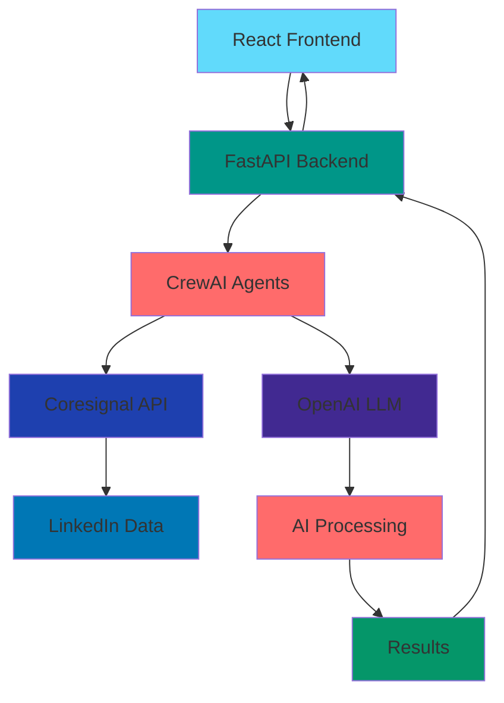

# 🤖 LinkedIn Sourcing Agent

An intelligent AI-powered LinkedIn candidate sourcing pipeline that combines FastAPI backend with CrewAI agents and a beautiful React frontend.

## 🏗️ Architecture

```
React UI → API Call → FastAPI Backend → CrewAI Agents → Coresignal API → Results → React UI
```

## 🛠️ Tech Stack

<div align="center">

### Frontend Technologies


### Backend Technologies


### AI & Machine Learning


### Data & APIs


### Deployment & Infrastructure


</div>

### Technology References

| Category | Technology | Version | Purpose | Documentation |
|----------|------------|---------|---------|---------------|
| **Frontend** | React | 19.1.0 | UI Framework | [React Docs](https://react.dev/) |
| **Frontend** | Vite | 7.0.0 | Build Tool | [Vite Docs](https://vitejs.dev/) |
| **Frontend** | Tailwind CSS | Latest | Styling | [Tailwind Docs](https://tailwindcss.com/) |
| **Frontend** | Lucide React | 0.525.0 | Icons | [Lucide Docs](https://lucide.dev/) |
| **Backend** | FastAPI | Latest | API Framework | [FastAPI Docs](https://fastapi.tiangolo.com/) |
| **Backend** | Python | 3.8+ | Programming Language | [Python Docs](https://docs.python.org/) |
| **Backend** | Uvicorn | Latest | ASGI Server | [Uvicorn Docs](https://www.uvicorn.org/) |
| **AI** | CrewAI | Latest | AI Agent Framework | [CrewAI Docs](https://docs.crewai.com/) |
| **AI** | OpenAI | Latest | LLM Provider | [OpenAI Docs](https://platform.openai.com/docs) |
| **Data** | Coresignal | Latest | LinkedIn Data | [Coresignal Docs](https://coresignal.com/) |
| **Deploy** | Render | Latest | Backend Hosting | [Render Docs](https://render.com/docs) |
| **Deploy** | Vercel | Latest | Frontend Hosting | [Vercel Docs](https://vercel.com/docs) |

### Architecture Overview



## 🚀 Live Demo

### Frontend Application
- **Local Development**: `http://localhost:5173/`
- **Production**: https://linkedin-sourcing-pipeline-7deovywqo.vercel.app

### Backend API
- **API Endpoint**: `https://linkedin-sourcing-agent.onrender.com`
- **Health Check**: `https://linkedin-sourcing-agent.onrender.com/health`

## 📁 Project Structure

```
LinkedIn-Sourcing-Agent/
├── frontend/                    # React application
│   ├── src/
│   │   ├── App.jsx             # Main component with API integration
│   │   └── ...
│   ├── package.json
│   └── vite.config.js
├── linkedin_sourcing_crewai/    # CrewAI agents
├── linkedin_sourcing_pipeline/  # FastAPI backend
├── requirements.txt
└── README.md
```

## 🛠️ Setup Instructions

### Backend Setup
```bash
# Install Python dependencies
pip install -r requirements.txt

# Set up environment variables
cp .env.example .env
# Edit .env with your API keys

# Run FastAPI server
cd linkedin_sourcing_pipeline
uvicorn main:app --reload
```

### Frontend Setup
```bash
# Navigate to frontend directory
cd frontend

# Install dependencies
npm install

# Start development server
npm run dev

# Build for production
npm run build
```

## 🎯 Features

### AI-Powered Candidate Discovery
- **Job Requirement Analysis**: Intelligent parsing of job descriptions
- **LinkedIn Profile Search**: Automated candidate discovery
- **AI Scoring**: Multi-factor candidate ranking
- **Personalized Outreach**: Custom message generation

### Beautiful UI/UX
- **Real-time Processing**: Live pipeline progress tracking
- **Candidate Cards**: Rich profile displays with scores
- **Score Breakdown**: Detailed matching criteria
- **Personalized Messages**: AI-generated outreach content

### API Integration
- **RESTful API**: FastAPI backend with automatic docs
- **Error Handling**: Graceful fallbacks and error recovery
- **Real-time Updates**: Live data synchronization

## 🔧 API Endpoints

- `POST /process_job_crewai` - Process job and find candidates
- `GET /health` - API health check
- `GET /docs` - Interactive API documentation

## 🚀 Deployment

### Frontend Deployment
1. **Vercel** (Recommended):
   ```bash
   npm install -g vercel
   cd frontend
   vercel
   ```

2. **Netlify**:
   ```bash
   cd frontend
   npm run build
   # Upload dist/ folder to Netlify
   ```

3. **GitHub Pages**:
   ```bash
   cd frontend
   npm run build
   # Configure GitHub Pages to serve dist/ folder
   ```

### Backend Deployment
- **Render**: Already deployed at `https://linkedin-sourcing-agent.onrender.com`
- **Railway**: Alternative deployment option
- **Heroku**: Traditional deployment platform

## 📊 Usage

1. **Start the Pipeline**: Click "Start Pipeline" in the UI
2. **View Progress**: Watch real-time processing steps
3. **Browse Candidates**: Review AI-scored candidates
4. **Personalized Outreach**: Send customized messages

## 🤝 Contributing

1. Fork the repository
2. Create a feature branch
3. Make your changes
4. Test thoroughly
5. Submit a pull request

## 📄 License

This project is licensed under the MIT License - see the LICENSE file for details.

## 🔗 Links

- **GitHub Repository**: https://github.com/guptashrey458/LinkedIn-Sourcing-Agent
- **Backend API**: https://linkedin-sourcing-agent.onrender.com
- **API Documentation**: https://linkedin-sourcing-agent.onrender.com/docs

---

**✅ Live Demo**: Your LinkedIn Sourcing Pipeline is now live at https://linkedin-sourcing-pipeline-7deovywqo.vercel.app 